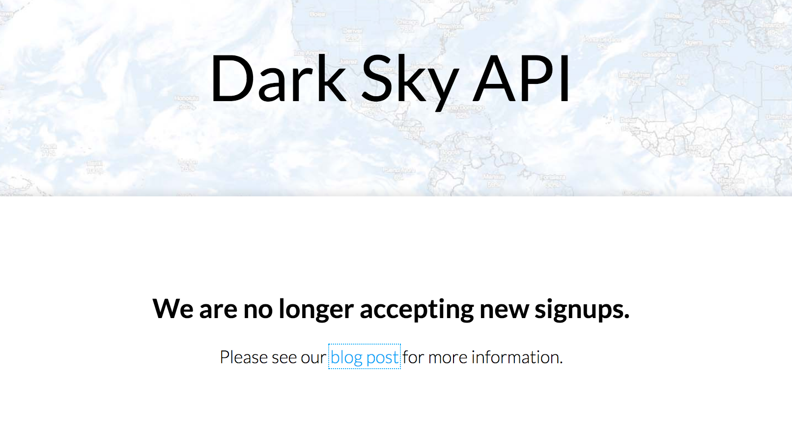
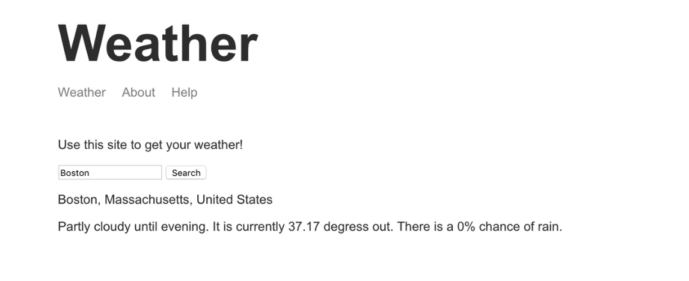

**Weather app**  
This is a weather forcast application.

This project interacting with **mapbox api** and **darksky api**. Input location to get the weather's information of the location.     

But this project is **deprecated** as **dark sky api service is going to shut down.**  

the screenshot of the project:

**How to run the project**  
nodemon src/app.js

using mapbox require an access token, so you need to create an account.
1. signup an account on mapbox  
2. mapbox api documentaion  
https://docs.mapbox.com/api/search/#geocoding  